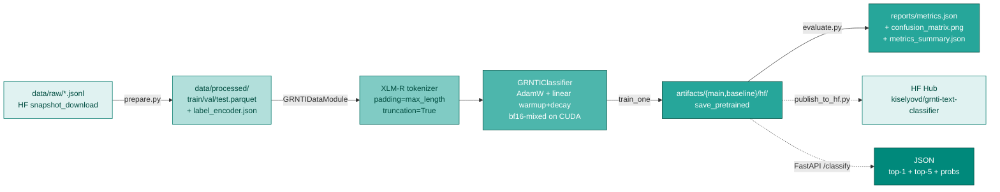

# Architecture

Two independent `save_pretrained` artefacts sharing the same `{top1_label, top1_prob, top5, truncated, input_length_tokens, request_id, model_version}` contract.

## Data flow

`scripts/sync_data.sh` calls `snapshot_download` from the HF Hub to pull `ai-forever/ru-scibench-grnti-classification` into `data/raw/` as JSONL shards. `grnti_text_classifier.data.prepare` reads those shards, fits a `LabelEncoder` over the 28 GRNTI top-level class codes, writes stratified `train/val/test.parquet` splits under `data/processed/`, and serialises the encoder to `data/processed/label_encoder.json`. The `GRNTIDataModule` wraps those Parquet files: it tokenises on-the-fly with the HF `AutoTokenizer` (`padding="max_length"`, `truncation=True`, `max_length=256`), returning `input_ids`, `attention_mask`, and `labels` tensors.

## Why XLM-RoBERTa-base over ruBERT

XLM-RoBERTa-base was pre-trained on 2.5 TB of CommonCrawl covering 100 languages including Russian. Its sub-word vocabulary (250 k sentencepiece tokens) achieves much lower out-of-vocabulary rates on Russian scientific terminology than the 120 k WordPiece vocabulary of ruBERT-base-cased. In practice this translates to longer effective context per 256-token window and better transfer on low-resource GRNTI sections. ruBERT-base-cased is retained as a single-language baseline: it is lighter, faster to fine-tune, and provides a meaningful reference point for any XLM-R gains.

## Inverse-frequency class weights

The ru-scibench-grnti-classification dataset is designed to be class-balanced, but minor residual imbalances remain across 28 sections. `train_one` passes `class_weights` (computed per-batch from inverse normalised class frequencies on the train split) into `CrossEntropyLoss`. This has negligible effect on top-1 accuracy but meaningfully protects macro F1: without weighting the rarest classes tend to be under-penalised, dragging the macro average below the weighted average.

## HF-native `save_pretrained`

Both models are serialised via the standard `PreTrainedModel.save_pretrained` / `tokenizer.save_pretrained` pattern into `artifacts/{main,baseline}/hf/`. This means any downstream consumer can load them with `AutoModelForSequenceClassification.from_pretrained(repo_id)` — zero extra config, no custom unpickling, and fully compatible with the HF Hub widget system for live inference demos on the model card.
