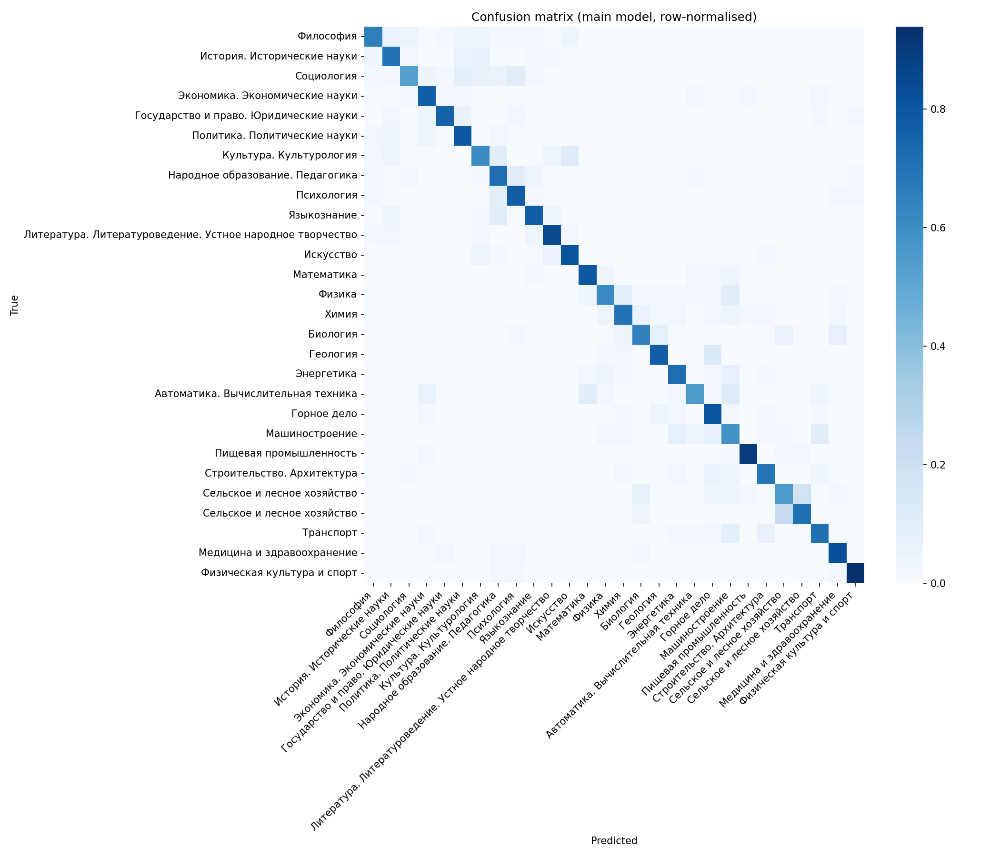
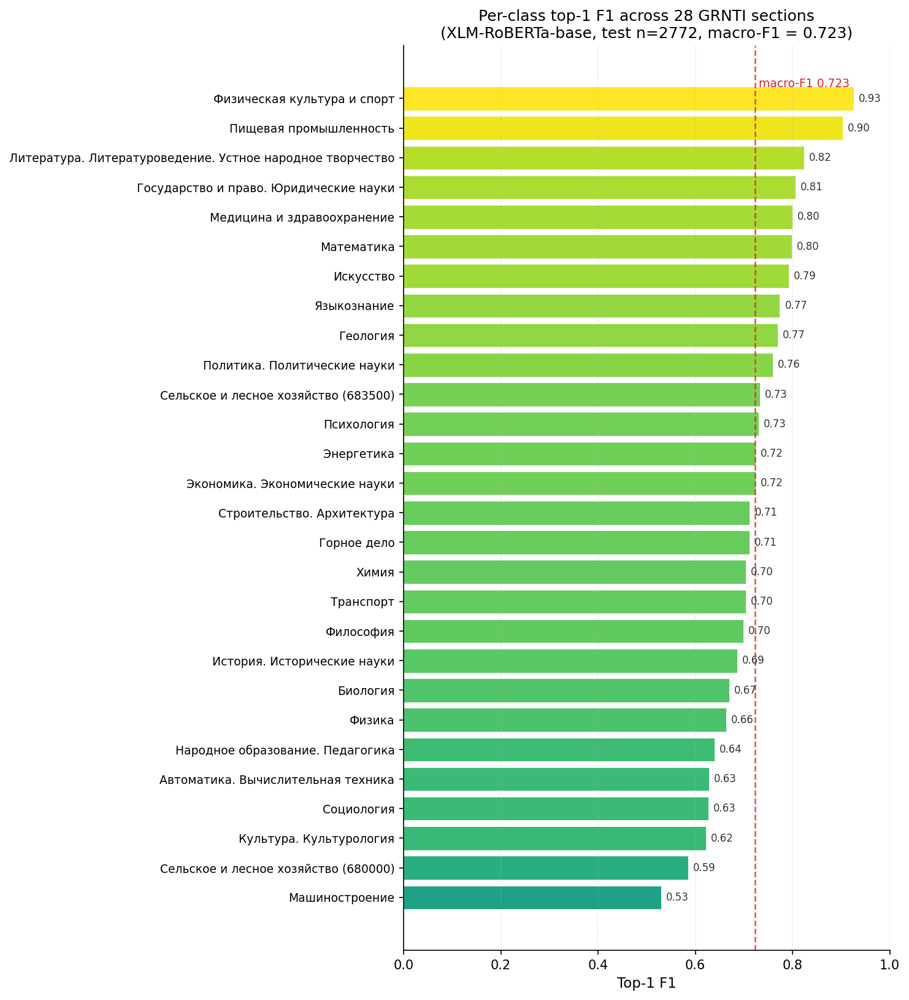

# grnti-text-classifier

Production-grade Russian scientific-text classifier over 28 top-level GRNTI (State Rubricator of Scientific and Technical Information) classes. Main model **XLM-RoBERTa-base**, fine-tuned with PyTorch Lightning on Russian research abstracts; baseline **ruBERT-base-cased**. Hydra-configured, Optuna-tuned, evaluated with top-1 / top-5 accuracy and macro / weighted F1, served by FastAPI as `/classify`.

> **Part of the [kiselyovd ML portfolio](https://github.com/kiselyovd#ml-portfolio)** - production-grade ML projects sharing one [cookiecutter template](https://github.com/kiselyovd/ml-project-template).

## At a glance

- **Dataset:** [ai-forever/ru-scibench-grnti-classification](https://huggingface.co/datasets/ai-forever/ru-scibench-grnti-classification) - 28 476 train / 2 772 test, 28 balanced GRNTI classes, median ~120 tokens under XLM-R tokenizer.
- **Main model:** XLM-RoBERTa-base, AdamW + linear warmup+decay, bf16-mixed on CUDA, inverse-frequency class weights.
- **Baseline:** ruBERT-base-cased - single-language BERT, same training loop, gives a strong Russian-only reference point.
- **Stack:** Python 3.12 / 3.13 · PyTorch Lightning · Transformers · Optuna · FastAPI · Hydra · DVC · MkDocs Material · uv.
- **Serving:** FastAPI `/classify` returns `{top1_label, top1_prob, top5, truncated, input_length_tokens, request_id, model_version}`.

## Results

Test set n = 2 772 abstracts across 28 GRNTI sections.

| Model | Top-1 accuracy | Top-5 accuracy | Macro F1 | Weighted F1 |
|-------|---------------:|---------------:|---------:|------------:|
| **XLM-RoBERTa-base (main)** | **72.4%** | **96.8%** | **72.3%** | **72.3%** |
| ruBERT-base-cased (baseline) | 72.9% | 95.9% | 72.8% | 72.8% |

Baseline slightly ahead on top-1, main ahead by +0.9pp on top-5 - XLM-R's multilingual pre-training gives a better top-k rerank, while the ru-only ruBERT is marginally sharper on the argmax.

## Visualizations

XLM-RoBERTa-base confusion matrix over the 28 GRNTI sections (test set, n = 2 772). Strong diagonal with off-diagonal mass concentrated between semantically adjacent sections.

Per-class F1 across all 28 GRNTI sections, ranked. Highlights the spread between well-separated and harder, overlapping classes that drive the 72.3% macro-F1.

## Navigation

- [Architecture](architecture.md) - data flow, mermaid diagram, and main-vs-baseline design decisions.
- [Training](training.md) - CLI commands, Hydra config layout, Optuna sweep notes, RTX 3080 timing, HF publish runbook.
- [Serving](serving.md) - `/classify` endpoint contract, Pydantic schemas, curl examples, environment variables.
- [API reference](api.md) - mkdocstrings-generated reference for the `grnti_text_classifier` package.

## Links

- GitHub: [kiselyovd/grnti-text-classifier](https://github.com/kiselyovd/grnti-text-classifier)
- Hugging Face model: [kiselyovd/grnti-text-classifier](https://huggingface.co/kiselyovd/grnti-text-classifier)
- Russian README: [README.ru.md](https://github.com/kiselyovd/grnti-text-classifier/blob/main/README.ru.md)
- Template: [kiselyovd/ml-project-template](https://github.com/kiselyovd/ml-project-template)

## Intended use and disclaimer

This model is a **portfolio/research demo** trained on the public ru-scibench-grnti-classification dataset. It is intended for educational purposes, ML-engineering review, and comparison against other baselines on the same dataset. Predictions should not be used as the sole basis for classifying real scientific publications in production systems without human review and domain validation.
